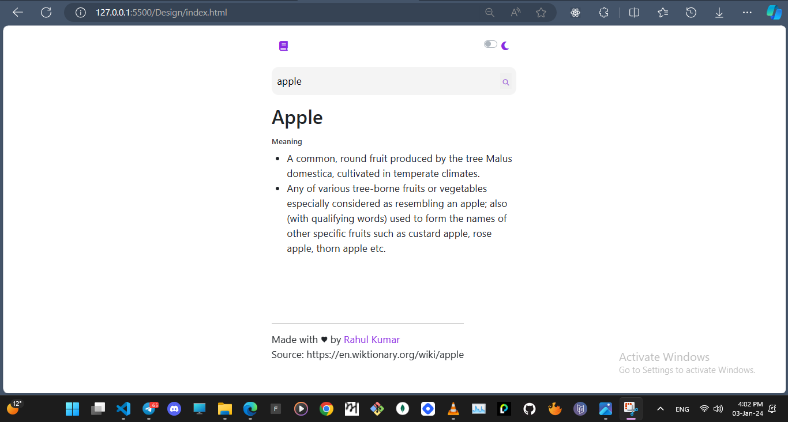

## Table of contents

- [Overview](#overview)
  - [The Project](#the-project)
  - [Screenshot](#screenshot)
  - [Links](#links)
- [My process](#my-process)
  - [Built with](#built-with)
- [Author](#author)

## Overview

### The Project

Users should be able to:

- Search the meaning of the words

### Screenshot

### Links

- Live Site URL: ([Dictionary App](https://news-homepage-main-rho-woad.vercel.app/))

## My process

### Built with

- Semantic HTML5 markup
- CSS custom properties
- Flexbox
- Bootstrap 
- Font Awesome
- Axios.get()
- Javascript

## Author

- Frontend Mentor - [@rahulkumarpahwa](https://www.frontendmentor.io/profile/rahulkumarpahwa)
- Twitter - [@rahulkumarpahwa](https://www.twitter.com/rahulkumarpahwa)
